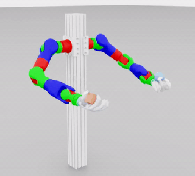

# BrainCo Isaac Lab

Isaac Lab environments, robot assets, and pretrained checkpoints for BrainCo dexterous manipulation tasks. Including:

- Revo3 in-hand repose
- Revo3 in-hand reorientation
- Revo3 HORA/RMA in-hand ball and cylinder rotation
- Revo3 right-hand lift
- RevoTron dynamic handover

## Included Tasks

| Robot | Framework | Public task ID | Checkpoint | Demo |
| --- | --- | --- | --- | --- |
| Revo3 | Direct | `BrainCo-Direct-Revo3-Repose-Cube-v0` | `checkpoints/BrainCo-Direct-Revo3-Repose-Cube-v0.pt` |  |
| Revo3 | Direct | `BrainCo-Direct-Revo3-Reorient-Cylinder-v0` | `checkpoints/BrainCo-Direct-Revo3-Reorient-Cylinder-v0.pt` |  |
| Revo3 | Dexsuite | `BrainCo-Dexsuite-Revo3-Right-Lift-v0` | `checkpoints/BrainCo-Dexsuite-Revo3-Right-Lift-v0.pt` |  |
| Revo3 | HORA | `BrainCo-Direct-Revo3-HoraRotate-Ball-v0` | `checkpoints/hora/revo3_right_ball_stage1_best.pth` |  |
| Revo3 | HORA | `BrainCo-Direct-Revo3-HoraRotate-Cylinder-v0` | `checkpoints/hora/revo3_right_cylinder_stage1_best.pth` |  |
| RevoTron | Dynamic Handover | `BrainCo-Dynamic-Handover-Revo3-Cube-v0` | `checkpoints/dynamic_handover/revotron_handover.pth` |  |

## Repository Layout

```text
BrainCo-IsaacLab/
├── assets/                 # Robot assets, object meshes, and grasp caches
│   ├── usd/                # USD assets grouped by task family
│   └── urdf/               # URDF assets and meshes
├── checkpoints/            # Pretrained checkpoints
├── image/                  # Task demo GIFs
├── scripts/rsl_rl          # RSL-RL training and evaluation scripts
├── scripts/rl_games        # RL-Games training and evaluation scripts
├── scripts/hora            # HORA PPO / ProprioAdapt training and export scripts
├── deploy/revo3            # Revo3 sim-to-real deployment package
└── source/BrainCo_DexHand/ # Isaac Lab extension package
```

## Requirements

- Python 3.10+
- A working [Isaac Lab](https://github.com/isaac-sim/IsaacLab) installation

This repository is distributed as an Isaac Lab extension package, not as a standalone simulator fork.

## Installation

1. Install Isaac Lab by following the official [Isaac Lab](https://github.com/isaac-sim/IsaacLab) setup for your target version.
2. Clone this repository into your workspace.
3. Install the BrainCo extension:

```bash
cd source/BrainCo_DexHand
pip install -e .
```

## Downloading Checkpoints

We provide a script to easily download all the pretrained checkpoints from our OSS server. Run the following command from the repository root:

```bash
./scripts/download-checkpoints.sh
```

This will download the `*.pt` files directly into the repository's `checkpoints/` directory.

## In-hand Manipulation

The in-hand manipulation environments use RSL-RL. The environments register when `BrainCo_DexHand` is importable in your Isaac Lab Python environment.

Check registration:

```bash
python -c "import BrainCo_DexHand"
```

Train:

```bash
python  scripts/rsl_rl/train.py --task BrainCo-Direct-Revo3-Repose-Cube-v0 --num_envs 8192 --headless
python  scripts/rsl_rl/train.py --task BrainCo-Direct-Revo3-Reorient-Cylinder-v0 --num_envs 4096 --headless
```

Evaluate:

```bash
python  scripts/rsl_rl/play.py --task BrainCo-Direct-Revo3-Repose-Cube-v0 --checkpoint checkpoints/BrainCo-Direct-Revo3-Repose-Cube-v0.pt --num_envs 1
python  scripts/rsl_rl/play.py --task BrainCo-Direct-Revo3-Reorient-Cylinder-v0 --checkpoint checkpoints/BrainCo-Direct-Revo3-Reorient-Cylinder-v0.pt --num_envs 1
```

## Grasping

The grasping task uses the Dexsuite Revo3 environment with RSL-RL.

Train:

```bash
python  scripts/rsl_rl/train.py --task BrainCo-Dexsuite-Revo3-Right-Lift-v0 --num_envs 4096 --headless
```

Evaluate:

```bash
python  scripts/rsl_rl/play.py --task BrainCo-Dexsuite-Revo3-Right-Lift-Play-v0 --checkpoint checkpoints/BrainCo-Dexsuite-Revo3-Right-Lift-v0.pt --num_envs 1
```

## HORA Training and Export

The HORA rotation tasks are integrated as a separate training path because their PPO, ProprioAdapt Stage 2 adapter, and checkpoint format are not RSL-RL-compatible. This integration is adapted from [HORA](https://github.com/HaozhiQi/hora).

Stage 1 PPO teacher training:

```bash
python scripts/hora/train.py --algo PPO --task ball --num_envs 16384 --headless
python scripts/hora/train.py --algo PPO --task cylinder --num_envs 16384 --headless
```

Stage 2 ProprioAdapt training from a Stage 1 checkpoint:

```bash
python scripts/hora/train.py --algo ProprioAdapt --checkpoint outputs/hora/revo3_right/run_ball/stage1_nn/best.pth --task ball --num_envs 16384 --headless
python scripts/hora/train.py --algo ProprioAdapt --checkpoint outputs/hora/revo3_right/run_cylinder/stage1_nn/best.pth --task cylinder --num_envs 16384 --headless
```

Evaluate a checkpoint:

```bash
python scripts/hora/train.py --algo PPO --task ball --num_envs 32 --test --checkpoint checkpoints/hora/revo3_right_ball_stage1_best.pth
python scripts/hora/train.py --algo PPO --task cylinder --num_envs 32 --test --checkpoint checkpoints/hora/revo3_right_cylinder_stage1_best.pth
```

Export a Stage 2 checkpoint to ONNX:

```bash
python scripts/hora/export_onnx.py \
  --stage stage2 \
  --checkpoint outputs/hora/revo3_right/run_ball/stage2_nn/model_best.ckpt \
  --output ball_hora_stage2.onnx
```

## Dynamic Handover

Dynamic handover uses the RevoTron asset and RL-Games. This task is adapted from [dynamic_handover](https://github.com/cypypccpy/dynamic_handover). Run from the repository root with the Isaac Lab Python environment activated.

Train:

```bash
python scripts/rl_games/train.py \
  --task BrainCo-Dynamic-Handover-Revo3-Cube-v0 \
  --num_envs 4096 \
  --headless
```

Evaluate:

```bash
python scripts/rl_games/play.py \
  --task BrainCo-Dynamic-Handover-Revo3-Cube-Play-v0 \
  --num_envs 1 \
  --checkpoint checkpoints/dynamic_handover/revotron_handover.pth
```

To manually switch toss direction during play, pass a command file:

```bash
python scripts/rl_games/play.py \
  --task BrainCo-Dynamic-Handover-Revo3-Cube-Play-v0 \
  --num_envs 1 \
  --checkpoint checkpoints/dynamic_handover/revotron_handover.pth \
  --command-file /tmp/handover_command.txt
```

Then update the command from another terminal:

```bash
echo 'right_throw' > /tmp/handover_command.txt
echo 'left_throw' > /tmp/handover_command.txt
```

## Sim-to-real Deployment

Below is a sim-to-real deployment of `BrainCo-Direct-Revo3-HoraRotate-Cylinder-v0`. More tasks' sim-to-real deployments will be released in the future.

<p align="center">
  
</p>

The Revo3 deployment runtime lives in `deploy/revo3`. It is a lightweight, ROS-free package for running exported ONNX policies on the real Revo3 hand through the Revo3 Python SDK.

The deploy loop is closed-loop: it reads measured joint positions from hardware, builds the policy observation history, runs ONNX inference, maps policy-order targets to SDK motor order, and sends MIT commands back to the hand. It is not a fixed trajectory replay tool.

Install the deploy package:

```bash
cd deploy/revo3
pip install -e .
```

Install the hardware extra when running on the real hand:

```bash
pip install -e ".[hardware]"
```

The runtime uses:

- `policy.onnx`: exported policy network
- `policy.yaml`: policy I/O contract and metadata
- `config/revo3_right.yaml`: joint order, joint limits, SDK settings, MIT gains, and sim-to-real offsets

Run a dry-run policy loop without sending commands:

```bash
python scripts/run_policy.py \
  --onnx artifacts/repose_cube/policy.onnx \
  --policy artifacts/repose_cube/policy.yaml \
  --profile config/revo3_right.yaml \
  --dry-run
```

See `deploy/revo3/README.md` for export and hardware run commands.

## Notes

- The Revo3 tasks IDs follow the `BrainCo-<framework>-<robot>-<task>-v0` naming convention.
- Checkpoints are provided for reproducibility and evaluation.
- Dynamic handover play supports command-file throw direction overrides: `right_throw` and `left_throw`.

## License

This repository is released under the MIT License. See [LICENSE](LICENSE).

Some files retain upstream Isaac Lab copyright and SPDX headers and remain
subject to their original notices. See [THIRD_PARTY_NOTICES.md](THIRD_PARTY_NOTICES.md).
