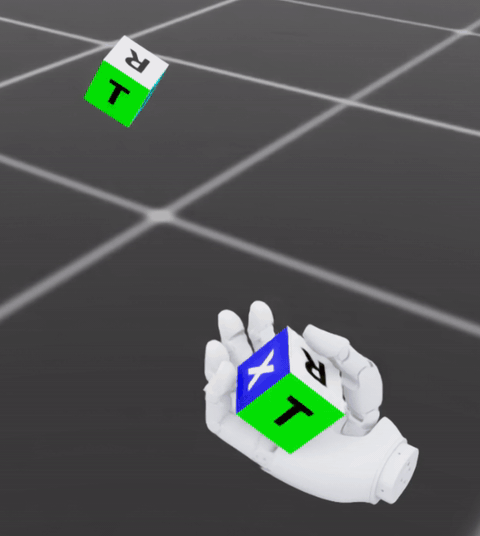
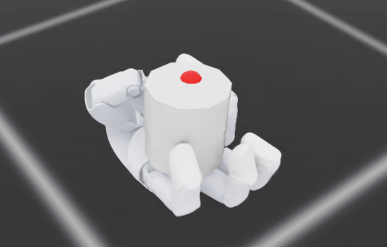
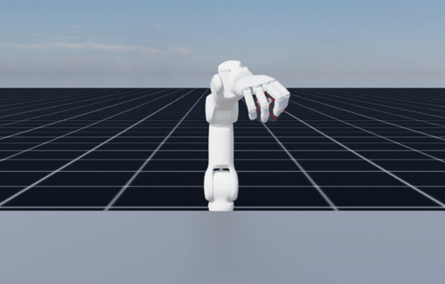

# BrainCo Isaac Lab

Isaac Lab environments, robot assets, and pretrained checkpoints for BrainCo dexterous manipulation tasks. Including:

- Revo3 in-hand repose
- Revo3 in-hand reorientation
- Revo3 right-hand lift

## Included Tasks

| Robot | Framework | Public task ID | Checkpoint | Demo |
| --- | --- | --- | --- | --- |
| Revo3 | Direct | `BrainCo-Direct-Revo3-Repose-Cube-v0` | `checkpoints/BrainCo-Direct-Revo3-Repose-Cube-v0.pt` |  |
| Revo3 | Direct | `BrainCo-Direct-Revo3-Reorient-Cylinder-v0` | `checkpoints/BrainCo-Direct-Revo3-Reorient-Cylinder-v0.pt` |  |
| Revo3 | Dexsuite | `BrainCo-Dexsuite-Revo3-Right-Lift-v0` | `checkpoints/BrainCo-Dexsuite-Revo3-Right-Lift-v0.pt` |  |

## Repository Layout

```text
BrainCo-IsaacLab/
├── checkpoints/            # Pretrained checkpoints
├── image/                  # Task demo GIFs
├── script/rsl_rl           # RL training and evaluation scripts
├── source/BrainCo_DexHand/ # Isaac Lab extension package
└── usd/                    # Isaac Sim / Isaac Lab USD assets
```

## Requirements

- Python 3.10+
- A working [Isaac Lab](https://github.com/isaac-sim/IsaacLab) installation

This repository is distributed as an Isaac Lab extension package, not as a standalone simulator fork.

## Installation

1. Install Isaac Lab by following the official [Isaac Lab](https://github.com/isaac-sim/IsaacLab) setup for your target version.
2. Clone this repository into your workspace.
3. Install the BrainCo extension:

```bash
cd source/BrainCo_DexHand
pip install -e .
```

## Downloading Checkpoints

We provide a script to easily download all the pretrained checkpoints from our OSS server. Run the following command from the repository root:

```bash
./scripts/download-checkpoints.sh
```

This will download the `*.pt` files directly into the repository's `checkpoints/` directory.

## Training and evaluation

The environments register when `BrainCo_DexHand` is importable in your Isaac Lab Python environment.

Examples:

```bash
python -c "import BrainCo_DexHand"
```

Use the training or play scripts with one of the task IDs above. Training commands:

```bash
python  scripts/rsl_rl/train.py --task BrainCo-Direct-Revo3-Repose-Cube-v0 --num_envs 8192 --headless
```

```bash
python  scripts/rsl_rl/train.py --task BrainCo-Direct-Revo3-Reorient-Cylinder-v0 --num_envs 4096 --headless
```
```bash
python  scripts/rsl_rl/train.py --task BrainCo-Dexsuite-Revo3-Right-Lift-v0 --num_envs 4096 --headless
```
Evaluation commands
```bash
python  scripts/rsl_rl/play.py --task BrainCo-Direct-Revo3-Repose-Cube-v0 --checkpoint checkpoints/BrainCo-Direct-Revo3-Repose-Cube-v0.pt --num_envs 1
```
```bash
python  scripts/rsl_rl/play.py --task BrainCo-Direct-Revo3-Reorient-Cylinder-v0 --checkpoint checkpoints/BrainCo-Direct-Revo3-Reorient-Cylinder-v0.pt --num_envs 1
```
```bash
python  scripts/rsl_rl/play.py --task BrainCo-Dexsuite-Revo3-Right-Lift-Play-v0 --checkpoint checkpoints/BrainCo-Dexsuite-Revo3-Right-Lift-v0.pt --num_envs 1
```

## Sim-to-real
Work in progress: current tasks are trained with `ImplicitActuatorCfg`, where the actuator dynamics are handled internally by the simulator. In the next release, we will update the identified dynamic parameters to improve sim-to-real performance.

Additional tasks and sim-to-real scripts will be released in future updates.

## Notes

- The Revo3 tasks IDs follow the `BrainCo-<framework>-<robot>-<task>-v0` naming convention.
- Checkpoints are provided for reproducibility and evaluation.

## License

This repository is released under the MIT License. See [LICENSE](LICENSE).

Some files retain upstream Isaac Lab copyright and SPDX headers and remain
subject to their original notices. See [THIRD_PARTY_NOTICES.md](THIRD_PARTY_NOTICES.md).
