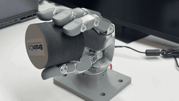

# Revo3 Sim-to-Real Deployment

`deploy/revo3` is a lightweight, ROS-free deployment package for running exported
ONNX policies on the real Revo3 hand through the Revo3 Python SDK.

Below is a sim-to-real deployment of `BrainCo-Direct-Revo3-HoraRotate-Cylinder-v0`.
More tasks' sim-to-real deployments will be released in the future.

<p align="center">
  
</p>

The runtime is closed-loop policy deployment, not trajectory replay. At each
control step it reads measured joint positions from hardware, builds the policy
observation history, runs ONNX inference, maps policy-order targets to SDK motor
order, and sends MIT commands back to the hand.

## Package Layout

- `revo3_deploy.input_builder`: builds the policy observation and proprioception history.
- `revo3_deploy.policy_runner`: validates `policy.yaml`, loads ONNX, and advances delta-action targets.
- `revo3_deploy.robot_profile`: validates joint limits, joint order mappings, and offsets.
- `revo3_deploy.sdk_hand_io`: talks to the Revo3 Python SDK (`bc-stark-sdk`).
- `scripts/export_policy.py`: exports a supported Isaac Lab policy to ONNX plus deploy metadata.
- `scripts/run_policy.py`: runs the closed-loop hardware or dry-run policy loop.

## Install

Install the deploy package:

```bash
cd deploy/revo3
pip install -e .
```

Install the hardware extra when running on the real hand:

```bash
pip install -e ".[hardware]"
```

The hardware extra installs `bc-stark-sdk==1.4.5`. If the SDK is distributed as
a wheel in your environment, install that wheel first, then install this package.

## Runtime Files

Deployment uses three files:

- `policy.onnx`: exported policy network.
- `policy.yaml`: policy I/O contract, action semantics, source checkpoint, and task metadata.
- `config/revo3_right.yaml`: SDK settings, MIT gains, joint order, joint limits, and sim-to-real offsets.

The runtime does not hardcode a checkpoint. The checkpoint is only used during
export, and the generated `policy.yaml` records it as `export.source_checkpoint`.
At deployment time, `scripts/run_policy.py` runs whichever `policy.onnx` and
`policy.yaml` paths you pass on the command line.

## Joint Orders

`config/revo3_right.yaml` stores both joint orders:

- `policy_joint_order`: Isaac Lab / ONNX action order.
- `sdk_joint_order`: Revo3 SDK motor order.

Runtime commands are generated in policy order and then permuted to SDK order by
joint name. SDK positions are read in degrees from the SDK and converted to
radians inside the deploy package.

## Export

Run export inside an Isaac Lab Python environment with this package installed.
The example below exports the published in-hand repose checkpoint:

```bash
python scripts/export_policy.py \
  --task BrainCo-Direct-Revo3-Repose-Cube-v0 \
  --checkpoint ../../checkpoints/BrainCo-Direct-Revo3-Repose-Cube-v0.pt \
  --output-dir artifacts/repose_cube
```

The output directory contains `policy.onnx`, `policy.pt`, and `policy.yaml`.
Before using a new policy on hardware, verify that the generated `policy.yaml`
matches the expected input/output contract for the runtime.

## Dry Run

Use `--dry-run` first to validate that the SDK can read hand state and the ONNX
policy can produce commands without sending commands to the motors:

```bash
python scripts/run_policy.py \
  --onnx artifacts/repose_cube/policy.onnx \
  --policy artifacts/repose_cube/policy.yaml \
  --profile config/revo3_right.yaml \
  --dry-run
```

## Hardware Run

Run the same artifact on hardware by removing `--dry-run`. The serial port,
slave ID, policy rate, and MIT gains can be supplied on the command line or
loaded from `config/revo3_right.yaml`.

```bash
python scripts/run_policy.py \
  --onnx artifacts/repose_cube/policy.onnx \
  --policy artifacts/repose_cube/policy.yaml \
  --profile config/revo3_right.yaml \
  --port /dev/ttyUSB0 \
  --slave-id 126
```

`/dev/ttyUSB0` and `126` are example hardware settings. Use the values for the
target hand and controller.
